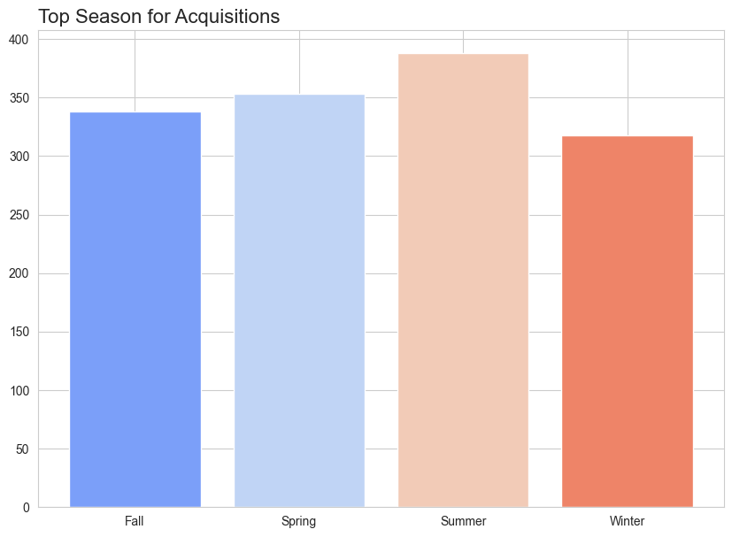
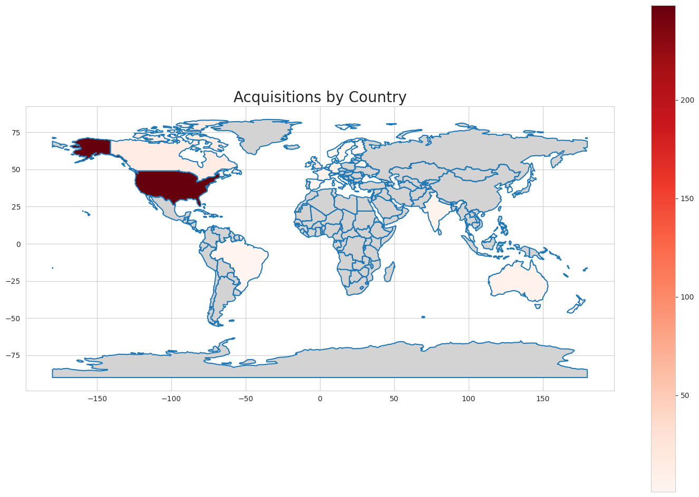
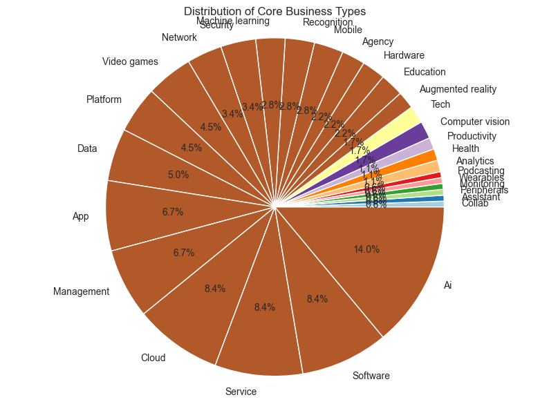
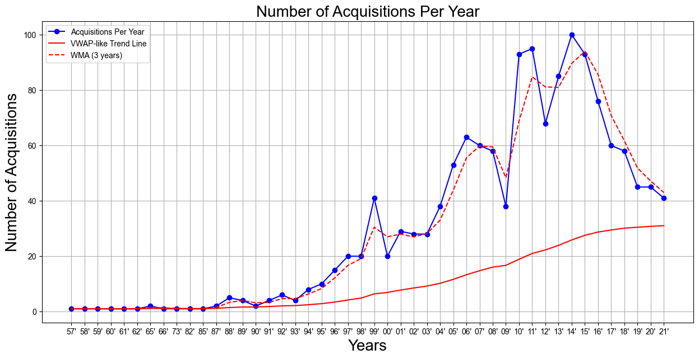
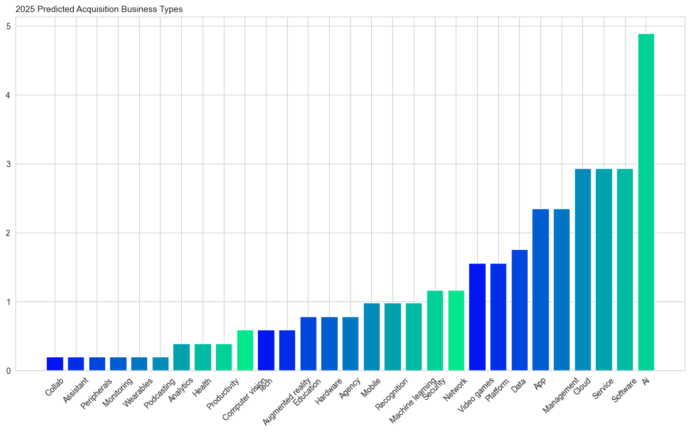

# async-orange-Roberto_Echeverria-final-project
## Dataset
[Merger and Acquisitions by Tech Companies](https://www.kaggle.com/datasets/shivamb/company-acquisitions-7-top-companies)

## Why did I choose this dataset?

[I chose this dataset to practice predictions with data while incorporating my interest in tech and business.]

## Progress
- [x] Picked dataset
- [x] Defined 10 questions
- [x] Answered 10 questions using Pandas
- [x] Added at least one data visualization (using Matplotlib and/or Seaborn) to each single question
- [x] Prepared presentation slides to present at graduation

## Questions
- [x] Question 1: [What were the top companies making aquisistions?]
  - Answer: [From the data we can observe the top companies doing acquisitions amoung our tech companies with Microsoft in the lead with 250+ companies acquired since 1957.]
  - Visualization: )

- [x] Question 2: [Relationship between aquisitions and years?]
  - Answer: [Throughout the years we can observe that the trend of these companies making acquisitions has increased substantially since 1998, peaking in 2014. The current trend of these companies making acquisitions is currently on a decline with around 40 per year.]
  - Visualization: )

- [x] Question 3: [Most reoccuring word in types of businesses?]
  - Answer: [The Top types of companies aquired have to do with software, managment, mobile, and service to name a few.]
  - Visualization: )

- [x] Question 4: [What months do these deals happen the most?]
  - Answer: [Acquisitions peak season is the summer while the least aqcuisitions occur during the winter.]
  - Visualization:  ) 

- [x] Question 5: [Which country makes the most aquisitions?]
  - Answer: [As we can tell from the heat map above, our specific companies like to Acquire American companies. It is also note worthy that even if youre company is not based in the US, you can still be considered for acquisition. ]
  - Visualization:   )

- [x] Question 6: [History of Prices paid for the companies?]
  - Answer: [The most common price tag of companies is not too aparent in the first histogram but it does tell us that most acquisitions are bought for less than 1.0e+09 or 1 billion dollars. To get a better picture of the prices I removed the outliers from our graph and only focused on the companies valued at sub 1 billion. **Most acquisitions being bought for less than 600 million dollars.** The highest valued company reaching a whopping **71 billion dollar valuation.** That was **21st Century Fox** acquired by **Disney**.]
  - Visualization: )

- [x] Question 7: [Portfolio of Microsoft?]
  - Answer: [There is an even split of different sectors in Microsofts acquisitions from 2020 - 2021.]
  - Visualization: )

- [x] Question 8: [Portfolio of Google?]
  - Answer: [Not many acquisitions from Google from 2020 - 2021.]
  - Visualization: )

- [x] Question 9: [Portfolio of Apple?]
  - Answer: [Only 2 acquisitions for Apple from 2020 - 2021 and a surprising one, a classical music streaming service!]
  - Visualization: )

- [x] Question 10: [What types of companies will be acquired in the future?]
  - Answer: [Predicted number of Acquisitions in 2025 - About 35 acquisitions will be made by the select few large companies in my dataset by looking at the trend lines. Then I multiply the number of companies by the % of business types in the pie chart. For Ai - 14% of those 35 companies will be Ai Acquisitions, or about 5 of them.]
  - Visualization:     )
